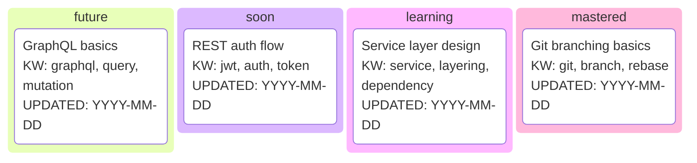

# Mastery Map

```mermaid
kanban
    future[future]
        [GraphQL basics
        KW: graphql, query, mutation
        UPDATED: YYYY-MM-DD]

    soon[soon]
        [REST auth flow
        KW: jwt, auth, token
        UPDATED: YYYY-MM-DD]

    learning[learning]
        [Service layer design
        KW: service, layering, dependency
        UPDATED: YYYY-MM-DD]

    mastered[mastered]
        [Git branching basics
        KW: git, branch, rebase
        UPDATED: YYYY-MM-DD]
```

Card format:
- `Concept Name`
- `KW: keyword1,keyword2`
- `UPDATED: YYYY-MM-DD`
